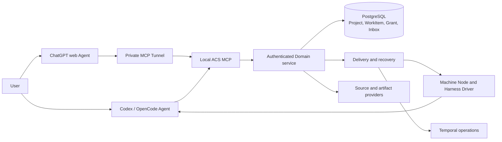
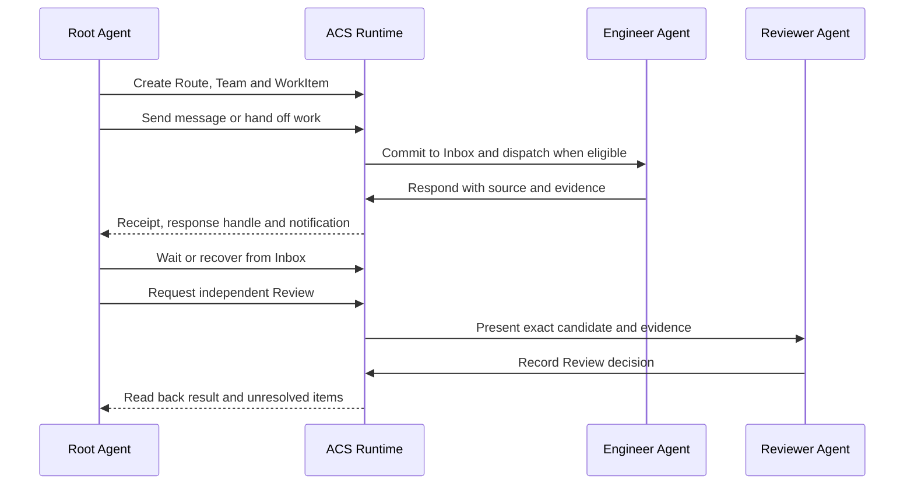

<div align="center">
  
  <h1>Agent Collaboration System</h1>
  <p>Durable project coordination for AI agents across sessions, machines and Harnesses.</p>
  <p><a href="README.zh-CN.md">简体中文</a> · <a href="docs/GETTING-STARTED.md">Get started</a> · <a href="docs/runtime/UPGRADE-CONTRACT.md">Runtime architecture</a></p>
</div>

ACS gives a project a stable **Management Root** and **Routes** for long-lived
development work. A Root Agent can organize teams and WorkItems, send messages,
recover responses from Inbox, inspect exact source evidence and request Review.
Codex and OpenCode act as external Agents; ACS persists identity, authorization,
delivery and recovery state in a shared Runtime.

## Start with an AI assistant

Send this repository URL to Codex or OpenCode on your machine:

```text
https://github.com/D1ChangGeng/Agent-collaboration
```

Then ask:

> Inspect this repository and guide me through installing ACS. First confirm
> where the Runtime should run: this Linux machine, a remote machine through
> SSH, or a WSL distribution. Confirm which Codex/OpenCode client hosts should
> connect. Ask whether to enable ChatGPT web now, use local Harnesses only, or
> configure web later. Probe the selected host, install the verified Release and
> configure the selected connections. Ask me for these choices and required
> authorizations.
> Verify services and actual MCP calls, report the machine and account binding,
> and explain the installed capabilities. For selected web access, complete AI
> configuration and guide the required owner page confirmations. I can initialize
> projects later with the setup Skill.

The [getting started guide](docs/GETTING-STARTED.md) starts with Runtime host
selection and client connection verification. Once the machine installation is
ready, the [setup Skill](SKILL.md) can create or adopt a project's Management
Root and lead into Route/Team setup, WorkItem delivery, Inbox recovery and
independent Review.

## Standard release installation

The Release Bootstrap uses an explicit Runtime destination: local Linux,
a named remote SSH target, or a named WSL distribution. It probes the selected
machine and account, downloads the selected GitHub Release, verifies
`SHA256SUMS.txt` and the embedded file manifest, then installs services and
private credentials on that host. Versioned private directories and the active
version pointer provide an upgrade and rollback record.

The Agent previews the install, binds apply to the observed machine identity,
account and home directory, and configures the selected Codex/OpenCode clients
on their own hosts. SSH and WSL install services through `--runtime-only` and
return a caller-side stdio MCP connection descriptor. The Agent installs Skills
and configures that descriptor on each selected client. Service
health and actual `tools/list`, `read_profile` and `list_projects` calls establish
machine readiness. A new installation can start with an empty project list.

ChatGPT web setup is an explicit installation choice: `enable`, `skip` or
`later`. For enabled web access, the Agent prepares the Runtime-host Tunnel
client, runs diagnostics and service setup, and guides required owner permissions,
private-key entry and ChatGPT connection confirmation. The
[web setup runbook](docs/runtime/P2-PRIVATE-TUNNEL-PROFILE.md) provides the full
sequence and official documentation index. The installation report records
the choice, observed Tunnel/web state and any remaining owner action.

When you start a project, ask the setup Skill to initialize or adopt its
Management Root. Project identity, Source registration and Root Agent startup
follow the [project setup path](docs/GETTING-STARTED.md#start-a-project).

The installation report records Runtime machine identity and account, selected
transport, client hosts, version/commit/tree, services, enabled Harnesses,
credential references and rollback state. Runtime Node enrollment and execution
capabilities have their own live verification.

## What you can manage

| Need | ACS capability |
| --- | --- |
| Organize a project | Stable Project and Management Root identity, Route registry and scoped project context |
| Build a team | AgentSlots, roles, Grants, Policies and budgets through `configure_team` |
| Delegate work | WorkItems, durable messages, handoff acknowledgement and response handles |
| Continue later | Bounded waits, notifications, Inbox reads and Session replacement recovery |
| Trust the result | Exact Git SourceBinding, Evidence, independent Review and accepted state |
| Connect clients | Profile-filtered MCP tools for Codex, OpenCode and a single-owner private ChatGPT Tunnel |

The Runtime tool catalog is [machine-readable](docs/runtime/p2-mcp-tool-contract.json).
Knowledge Skills under [docs/runtime/skills](docs/runtime/skills/README.md)
explain the project, collaboration, continuity, source, policy and Review
models as an Agent needs them.

## Architecture



External Agents choose goals, delegation and Review decisions. The Domain
checks identity, project scope, Grant and revision before committing state.
Node and Driver integrations observe actual Harness sessions and execution.
Git commits and trees remain the source of truth for repository content.

## A collaboration cycle



For example, a Root Agent can ask an Engineer to change one feature, keep the
WorkItem and message handle across a Session restart, inspect the output commit
and test evidence, and route that candidate to a Reviewer. The
[engineering evidence index](docs/runtime/P2-EXECUTION-STATUS.md) records the
exact scope of measured cross-machine, cross-Harness and MCP behavior.

## Install and connect

The Source/CAS Runtime service runs on Linux. Choose local Linux, a remote
Linux host through SSH, or a named WSL distribution; Windows Codex/OpenCode
connect through the selected service host's MCP process. Installation uses
Python 3.12+, Git, uv and Docker Compose for PostgreSQL and Temporal. The Agent
checks the selected host and performs setup; you choose the destination and
complete machine privilege or account consent prompts.

Use `scripts/acs_bootstrap.py` from the selected Release for the machine
installation. Its destination flags are `--runtime-host local|ssh|wsl`,
`--ssh-target` and `--wsl-distribution`. Supply the preview's
`--expected-machine-id`, `--expected-account` and `--expected-user-home` before
apply; select clients with `--harness codex opencode`. The bounded Linux
`acs_install.py` entry
requires `--host-confirmed`. It installs the locked Python environment, starts
owner-local services and initializes a private owner Authority. Local Linux
setup installs nine Skills and configures selected clients on that host by
default; `--runtime-only` selects service setup. For SSH/WSL, the Agent installs
Skills and configures MCP on the selected client hosts, verifies their actual
connections, and can then offer project setup.
See [getting started](docs/GETTING-STARTED.md) and
[troubleshooting](docs/TROUBLESHOOTING.md).

For ChatGPT web, the [single-user private Tunnel
profile](docs/runtime/P2-PRIVATE-TUNNEL-PROFILE.md) connects an installation
owner's Linux MCP process through their OpenAI Platform organization and
ChatGPT workspace. Follow the current [official Tunnel
guide](https://developers.openai.com/api/docs/guides/secure-mcp-tunnels)
for platform permissions and connection steps.

## Project and source boundaries

The preferred layout keeps the Management Root inside the project's Git source
checkout. Root and Route instructions, knowledge and project metadata travel
with the repository; Runtime observations and credentials stay in private local
storage. Message delivery and Git synchronization are recorded independently.
The [setup Skill](SKILL.md) provides guarded bootstrap, adopt, repair, upgrade
and validation operations for the project files.

## Development and support

The repository includes [contribution guidance](CONTRIBUTING.md),
[security reporting](SECURITY.md), [change history](CHANGELOG.md) and a
[Sustainable Use License 1.0](LICENSE). The license permits free public
distribution under its stated use and redistribution terms. Release packages
carry a source-bound manifest and SHA-256 digest list.
