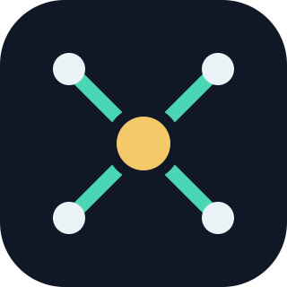
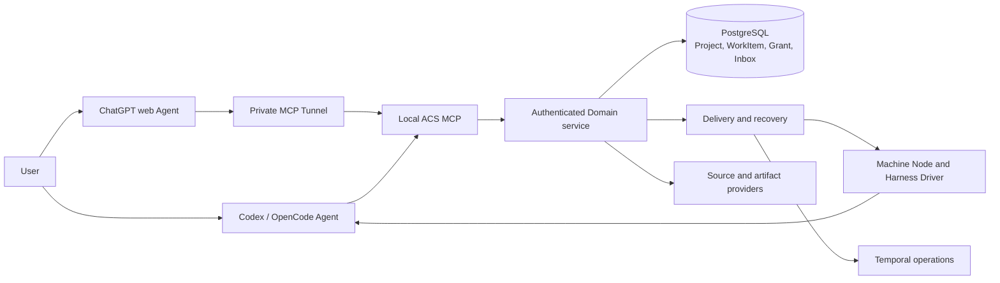
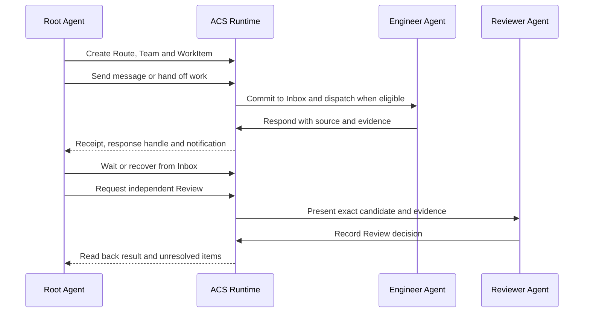

<div align="center">
  
  <h1>Agent Collaboration System</h1>
  <p>Durable project coordination for AI agents across sessions, machines and Harnesses.</p>
  <p><a href="README.zh-CN.md">简体中文</a> · <a href="docs/GETTING-STARTED.md">Get started</a> · <a href="docs/runtime/UPGRADE-CONTRACT.md">Runtime architecture</a></p>
</div>

ACS gives a project a stable **Management Root** and **Routes** for long-lived
development work. A Root Agent can organize teams and WorkItems, send messages,
recover responses from Inbox, inspect exact source evidence and request Review.
Codex and OpenCode act as external Agents; ACS persists identity, authorization,
delivery and recovery state in a shared Runtime.

## Start with an AI assistant

Send this repository URL to Codex or OpenCode on your machine:

```text
https://github.com/D1ChangGeng/Agent-collaboration
```

Then ask:

> Inspect this repository and guide me through installing ACS. Check my machine
> and project, perform the setup steps you can run, and ask me only for the
> project choices and authorizations I need to make. Verify the installed
> services and MCP tools, explain what collaboration capabilities are available,
> and help me open the Management Root as a Root Agent session.

The [getting started guide](docs/GETTING-STARTED.md) gives the Agent a complete
first-use path. It covers installation reporting, project adoption, a Route and
Team, WorkItem delivery, Inbox recovery and independent Review. The Agent can
use `scripts/acs_doctor.py` for a read-only readiness report and
`scripts/acs_install.py` to preview and apply local setup. Real project Source
registration and live Harness connection are verified as separate steps.

## What you can manage

| Need | ACS capability |
| --- | --- |
| Organize a project | Stable Project and Management Root identity, Route registry and scoped project context |
| Build a team | AgentSlots, roles, Grants, Policies and budgets through `configure_team` |
| Delegate work | WorkItems, durable messages, handoff acknowledgement and response handles |
| Continue later | Bounded waits, notifications, Inbox reads and Session replacement recovery |
| Trust the result | Exact Git SourceBinding, Evidence, independent Review and accepted state |
| Connect clients | Profile-filtered MCP tools for Codex, OpenCode and a single-owner private ChatGPT Tunnel |

The Runtime tool catalog is [machine-readable](docs/runtime/p2-mcp-tool-contract.json).
Knowledge Skills under [docs/runtime/skills](docs/runtime/skills/README.md)
explain the project, collaboration, continuity, source, policy and Review
models as an Agent needs them.

## Architecture



External Agents choose goals, delegation and Review decisions. The Domain
checks identity, project scope, Grant and revision before committing state.
Node and Driver integrations observe actual Harness sessions and execution.
Git commits and trees remain the source of truth for repository content.

## A collaboration cycle



For example, a Root Agent can ask an Engineer to change one feature, keep the
WorkItem and message handle across a Session restart, inspect the output commit
and test evidence, and route that candidate to a Reviewer. The
[engineering evidence index](docs/runtime/P2-EXECUTION-STATUS.md) records the
exact scope of measured cross-machine, cross-Harness and MCP behavior.

## Install and connect

The setup Skill and Runtime are separate packages in this repository. The setup
Skill manages project scaffolding; the Runtime exposes typed collaboration
tools and persists shared state. The Source/CAS Runtime service runs on Linux;
Windows Codex and OpenCode connect as clients to an admitted Linux service.
A local service installation uses Python 3.12+, Git, uv and Docker Compose for
PostgreSQL and Temporal. The Agent checks these prerequisites and handles supported
installation actions. You complete machine
privilege and account consent prompts.

The Linux setup entry prints a plan first. With `--apply`, it installs the
locked Python environment and nine Skills, starts owner-local services,
initializes a private owner authority and adopts a specified Management Root.
For a clean committed project Source, it registers the project and reads back
its context. On the Runtime host it configures local Codex and OpenCode MCP
entries with rollback copies; the Agent verifies tool discovery in each client
before reporting collaboration ready.
See [getting started](docs/GETTING-STARTED.md) and
[troubleshooting](docs/TROUBLESHOOTING.md).

For ChatGPT web, the [single-user private Tunnel
profile](docs/runtime/P2-PRIVATE-TUNNEL-PROFILE.md) connects an installation
owner's Linux MCP process through their OpenAI Platform organization and
ChatGPT workspace. Follow the current [official Tunnel
guide](https://developers.openai.com/api/docs/guides/secure-mcp-tunnels)
for platform permissions and connection steps.

## Project and source boundaries

The preferred layout keeps the Management Root inside the project's Git source
checkout. Root and Route instructions, knowledge and project metadata travel
with the repository; Runtime observations and credentials stay in private local
storage. Message delivery and Git synchronization are recorded independently.
The [setup Skill](SKILL.md) provides guarded bootstrap, adopt, repair, upgrade
and validation operations for the project files.

## Development and support

The repository includes [contribution guidance](CONTRIBUTING.md),
[security reporting](SECURITY.md), [change history](CHANGELOG.md) and a
[Sustainable Use License 1.0](LICENSE). The license permits free public
distribution under its stated use and redistribution terms. Release packages
carry a source-bound manifest and SHA-256 digest list.
