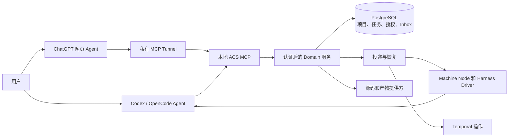
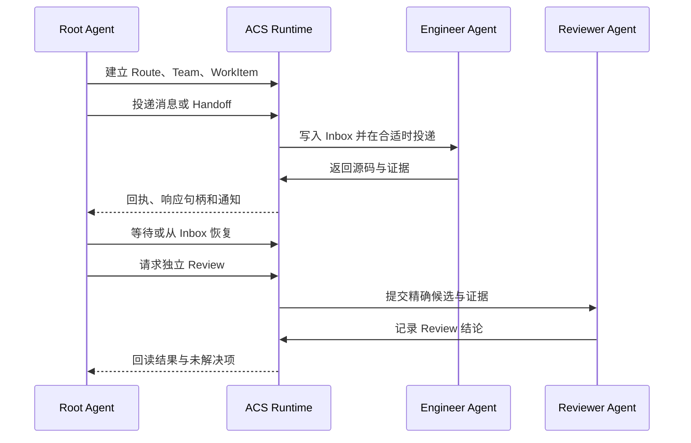

<div align="center">
  
  <h1>Agent Collaboration System</h1>
  <p>为跨会话、跨机器、跨 Harness 的 AI 协作提供持久项目管理能力。</p>
  <p><a href="README.md">English</a> · <a href="docs/GETTING-STARTED.md">开始使用</a> · <a href="docs/runtime/UPGRADE-CONTRACT.md">运行架构</a></p>
</div>

ACS 在项目中建立稳定的 **Management Root** 和 **Route**。Root Agent 可以配置
Team、管理 WorkItem、投递消息、从 Inbox 恢复响应、核对源码证据并发起独立
Review。Codex 和 OpenCode 是外部 Agent；ACS Runtime 保存身份、授权、投递和
恢复状态。

## 把仓库链接交给 AI

将以下链接发给本机 Codex 或 OpenCode：

```text
https://github.com/D1ChangGeng/Agent-collaboration
```

然后告诉它：

> 请检查这个仓库并带我安装 ACS。先识别本机和目标项目，执行你能完成的
> 安装与配置；只就项目选择和必须由我确认的授权事项提问。安装后请实际
> 验证服务和 MCP 工具，说明我拥有的协作能力，并带我进入 Management Root
> 启动 Root Agent 会话。

[首次使用指南](docs/GETTING-STARTED.md)列出了安装报告、项目接入、创建
Route/Team、WorkItem 投递、Inbox 恢复和独立 Review 的完整路径。AI 可以用
`scripts/acs_doctor.py` 生成只读环境报告，并用 `scripts/acs_install.py`
预览与执行本地设置。项目 Source 注册和 Harness 实际连接各自需要读回验证。

## 协作能力

| 需求 | ACS 能力 |
| --- | --- |
| 管理项目 | 稳定的 Project、Management Root、Route 与项目上下文 |
| 配置团队 | AgentSlot、角色、Grant、Policy 和预算 |
| 交付工作 | WorkItem、持久消息、Handoff 确认与响应句柄 |
| 异步继续 | 有界等待、通知、Inbox 和 Session 替换恢复 |
| 审查结果 | Git SourceBinding、Evidence、独立 Review 和接受状态 |
| 连接客户端 | 面向 Codex、OpenCode 与个人 ChatGPT Tunnel 的 MCP 工具 |

[MCP 工具目录](docs/runtime/p2-mcp-tool-contract.json)给出机器可读接口；
[Runtime Skills](docs/runtime/skills/README.md)提供项目、协作、连续性、源码、
授权和 Review 的按需知识。

## 架构



外部 Agent 负责目标、委派与 Review 决策；Domain 在写入前核对身份、项目范围、
Grant 和修订号。Node 与 Driver 观察真实 Harness 会话与执行，Git commit/tree
界定源码状态。

## 一个完整协作流程



例如，Root Agent 可以将一次功能改动交给 Engineer，在会话重启后继续追踪同一
WorkItem 与消息句柄，再核对输出 commit、测试证据并送交 Reviewer。
[P2 执行索引](docs/runtime/P2-EXECUTION-STATUS.md)记录已测量的跨机器、
跨 Harness 与 MCP 结果的精确范围。

## 安装与接入

仓库包含项目 setup Skill 和协作 Runtime。Skill 管理项目文件；Runtime 提供
类型化工具与持久状态。Source/CAS Runtime 服务运行在 Linux；Windows 的
Codex 和 OpenCode 作为客户端连接已接入的 Linux 服务。服务安装使用
Python 3.12+、Git、uv、Docker Compose、PostgreSQL 和 Temporal。
AI 检查先决条件并完成可自动执行的步骤；你负责系统
权限和账号确认。

Linux 安装入口先输出计划；指定 `--apply` 后安装锁定的 Python 环境与九个 Skills、
启动本地服务，并接入指定 Management Root。它报告 `local_services_ready` 和
剩余的 Runtime 身份、Source 注册与 Harness MCP 检查；AI 完成并回读这些步骤后
再报告协作就绪。详见[首次使用指南](docs/GETTING-STARTED.md)
和[排错指南](docs/TROUBLESHOOTING.md)。

ChatGPT 网页端可通过[单用户私有 Tunnel Profile](docs/runtime/P2-PRIVATE-TUNNEL-PROFILE.md)
连接安装者 Linux Runtime 主机上的 MCP 服务。Windows Harness 可以作为客户端；
平台权限与网页连接操作请由 AI 依据
[官方 Tunnel 文档](https://developers.openai.com/api/docs/guides/secure-mcp-tunnels)
提供实时指引。

## 项目与源码边界

推荐把 Management Root 放在项目 Git checkout 内。Root/Route 指令、知识与
项目元数据随仓库同步；运行观测和凭据留在本机私有存储。消息投递与 Git 同步
分别记录。[setup Skill](SKILL.md)提供受控的建立、接管、修复、升级和验证。

仓库提供[贡献说明](CONTRIBUTING.md)、[安全报告方式](SECURITY.md)、
[变更记录](CHANGELOG.md)与 [Sustainable Use License 1.0](LICENSE)。许可允许在其
用途和再分发条款内免费公开分发。发行包附带源码绑定清单和 SHA-256 摘要。
