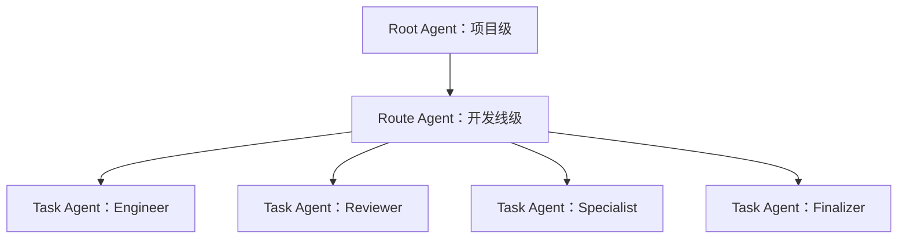
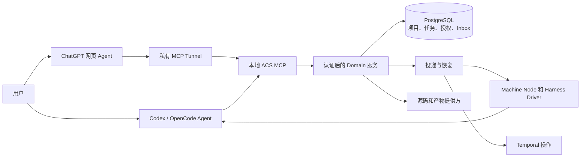
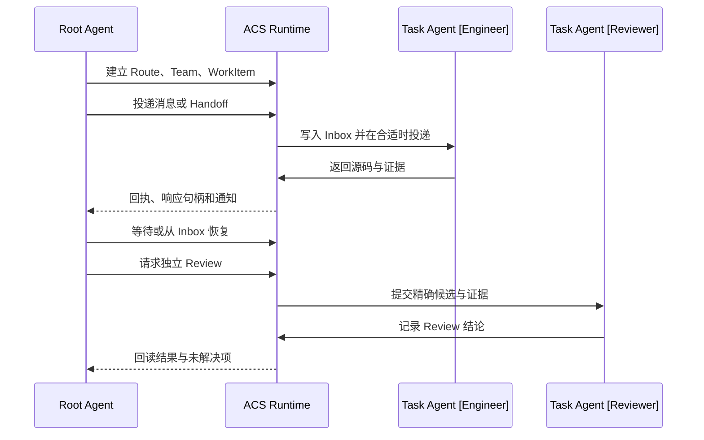

<div align="center">
  
  <h1>Agent Collaboration System</h1>
  <p>为跨会话、跨机器、跨 Harness 的 AI 协作提供持久项目管理能力。</p>
  <p><a href="README.md">English</a> · <a href="docs/GETTING-STARTED.md">开始使用</a> · <a href="docs/runtime/UPGRADE-CONTRACT.md">运行架构</a></p>
</div>

ACS 在项目中建立稳定的 **Management Root** 和 **Route**。Root Agent 可以配置
Team、管理 WorkItem、投递消息、从 Inbox 恢复响应、核对源码证据并发起独立
Review。Codex 和 OpenCode 是外部 Agent；ACS Runtime 保存身份、授权、投递和
恢复状态。

## 把仓库链接交给 AI

将以下链接发给本机 Codex 或 OpenCode：

```text
https://github.com/D1ChangGeng/Agent-collaboration
```

然后告诉它：

> 请检查这个仓库并带我安装 ACS。先确认 Runtime 的安装位置：本机 Linux、
> 通过 SSH 访问的远程机器，或指定的 WSL 发行版；再确认哪些机器上的
> Codex/OpenCode 需要连接。接着询问是否现在接入 ChatGPT 网页、仅使用本地
> Harness，或稍后配置网页。对选定主机做只读检查，安装经过校验的 Release
> 并配置所选连接。只就这些选择和必要授权提问。安装后实际验证服务与 MCP 调用，
> 报告机器、账号和连接绑定，说明已安装能力。选择网页接入时，由 AI 完成配置，
> 在我的客户端机器上的外部浏览器中，按我已有的设置授权协助导航，或提供准确步骤，
> 由我完成并确认。项目可以之后通过 setup Skill 初始化。

[首次使用指南](docs/GETTING-STARTED.md)从 Runtime 主机选择和客户端连接验证
开始。机器安装就绪后，可以调用 [setup Skill](SKILL.md)创建或接入项目
Management Root，随后使用 Route/Team、WorkItem 投递、Inbox 恢复和独立 Review。

## 协作能力

| 需求 | ACS 能力 |
| --- | --- |
| 管理项目 | 稳定的 Project、Management Root、Route 与项目上下文 |
| 配置团队 | AgentSlot、角色、Grant、Policy 和预算 |
| 交付工作 | WorkItem、持久消息、Handoff 确认与响应句柄 |
| 异步继续 | 条件等待、可选调用方超时、通知、Inbox 和 Session 替换恢复 |
| 审查结果 | Git SourceBinding、Evidence、独立 Review 和接受状态 |
| 连接客户端 | 面向 Codex、OpenCode 与个人 ChatGPT Tunnel 的 MCP 工具 |

[MCP 工具目录](docs/runtime/p2-mcp-tool-contract.json)给出机器可读接口；
[Runtime Skills](docs/runtime/skills/README.md)提供项目、协作、连续性、源码、
授权和 Review 的按需知识。

## Agent 组织模型

Root Agent 负责项目级范围，Route Agent 负责开发线级范围。**Task Agent**
是承担明确任务的外部 Agent 的候选统称；Engineer、Reviewer、Specialist、Finalizer
表示职责，可在实际授权允许的情况下组合。



组织责任范围、Role、Profile 与 Grant 各有独立含义。现有 AgentSlot、WorkItem
和可替换 Session 承载具体绑定。独立 Review 核对候选参与者身份；接受操作核对
授权与精确 Source、Evidence、Review、回读证据。
[组织模型提案](docs/runtime/AGENT-ORGANIZATION-MODEL.md)说明术语、兼容关系和上下文表达。

## 架构



外部 Agent 负责目标、委派与 Review 决策；Domain 在写入前核对身份、项目范围、
Grant 和修订号。Node 与 Driver 观察真实 Harness 会话与执行，Git commit/tree
界定源码状态。

## 一个完整协作流程



例如，Root Agent 可以将一次功能改动交给 Engineer，在会话重启后继续追踪同一
WorkItem 与消息句柄，再核对输出 commit、测试证据并送交 Reviewer。
[工程证据索引](docs/runtime/P2-EXECUTION-STATUS.md)记录已测量的跨机器、
跨 Harness 与 MCP 结果的精确范围。

## 安装与接入

### 标准 Release 安装

使用 [v1.3.1 Release](https://github.com/D1ChangGeng/Agent-collaboration/releases/tag/v1.3.1)
提供的 `acs_bootstrap.py` 入口，开始经过校验的安装流程。
升级路径见[发布说明](docs/RELEASE-NOTES-v1.3.1.md)。

Release Bootstrap 使用明确的 Runtime 安装目标：本机 Linux、指定的远程 SSH
目标，或指定的 WSL 发行版。它检查选定机器与账号，下载指定 GitHub Release，
校验 `SHA256SUMS.txt` 和发行包内文件清单，再在该主机安装服务与私有凭据。
版本目录和当前版本指针记录升级状态，并保留回滚目标。

AI 先预览安装计划，将执行绑定到已观测的完整机器身份、账号与主目录，再在各客户端
所在主机配置选定的 Codex/OpenCode。SSH 和 WSL 通过 `--runtime-only` 安装服务，
返回调用方可用的 stdio MCP 连接描述。AI 在选定客户端安装 Skills 并配置连接。
服务健康状态及实际 `tools/list`、`read_profile`、`list_projects` 调用共同验证机器就绪；
新安装可以从空项目列表开始。

ChatGPT 网页接入是明确的安装选项：现在启用（`enable`）、仅用本地客户端
（`skip`）或稍后配置（`later`）。启用时，AI 在 Runtime 主机安装和配置 Tunnel
客户端、运行诊断并配置服务，向用户说明必须亲自完成的权限确认、私有密钥录入
和 ChatGPT 连接确认。账号页面使用你在客户端机器上的外部浏览器。只有当前 Harness
确实具备该机器的浏览器控制能力时，AI 可在你已给出的设置授权范围内协助导航；
必要的登录、
权限、密钥录入和连接同意由你确认。你也可以按官方链接、准确页面标签、操作和预期
结果自行完成；AI 等待确认后再实际验证 MCP 调用。[网页接入手册](docs/runtime/P2-PRIVATE-TUNNEL-PROFILE.md)
提供完整步骤与官方文档索引；安装报告记录选择、实际 Tunnel/网页状态和待完成操作。

开始项目时，调用 setup Skill 初始化或接入 Management Root。项目身份、Source
注册和 Root Agent 启动按[项目设置路径](docs/GETTING-STARTED.md#start-a-project)完成。
安装报告记录 Runtime 机器身份与账号、连接方式、客户端主机、版本与 commit/tree、
服务、启用的 Harness、凭据引用及回滚状态。Runtime Node 注册与执行能力各自
需要实际验证。

Source/CAS Runtime 服务运行在 Linux。可以选择本机 Linux、通过 SSH 访问的
远程 Linux 主机，或指定的 WSL 发行版；Windows Codex/OpenCode 通过选定服务
主机上的 MCP 进程连接。服务安装使用 Python 3.12+、Git、uv、Docker Compose、
PostgreSQL 和 Temporal。AI 检查选定主机并执行安装；你选择目标，完成系统权限
或账号确认。

机器安装使用选定 Release 的 `scripts/acs_bootstrap.py`。目标参数为
`--runtime-host local|ssh|wsl`、`--ssh-target` 和 `--wsl-distribution`。
执行时传入预览返回的 `--expected-machine-id`、`--expected-account` 和
`--expected-user-home` 三项身份绑定参数；`--harness codex opencode` 选择客户端。
受控 Linux 入口 `acs_install.py` 要求 `--host-confirmed`；它安装锁定的 Python
环境、启动本地服务并建立安装者私有 Authority。本机 Linux 默认安装九个 Skills 并
配置该主机上选定的客户端，`--runtime-only` 选择服务安装。SSH/WSL 的客户端 Skills
与 MCP 由 AI 在选定客户端主机配置，实际验证连接后再引导项目设置。详见[首次使用指南](docs/GETTING-STARTED.md)
和[排错指南](docs/TROUBLESHOOTING.md)。

ChatGPT 网页端可通过[单用户私有 Tunnel Profile](docs/runtime/P2-PRIVATE-TUNNEL-PROFILE.md)
连接安装者 Linux Runtime 主机上的 MCP 服务。Windows Harness 可以作为客户端；
平台权限与网页连接操作请由 AI 依据
[官方 Tunnel 文档](https://developers.openai.com/api/docs/guides/secure-mcp-tunnels)
提供实时指引。

## 自动升级

ACS v1.3.0 新安装默认启用自动升级。ACS 在已安装的 Runtime 主机上每天检查
最新稳定 Release，完成发行包、现有安装文件、服务健康和已有授权校验后，激活兼容
更新。优先使用安装者账号的 systemd 用户计时器，cron 作为后备；新 MCP 连接也会
在后台补查。安装报告记录实际调度方式及其状态。

安装时可用 `--no-auto-update` 关闭自动升级，或用 `--auto-update` 明确启用。
普通升级未指定这两个参数时，保留已有的关闭设置。安装后通过 Bootstrap 的
`--set-auto-update on|off|status` 管理设置。稳定启动命令让后续本机、SSH、WSL 和
Tunnel 连接使用已激活版本，现有会话继续使用当前版本。兼容性发生变化时，由 AI
引导审查和升级；上一版本保留为回滚目标。

已有 v1.2.0 安装需要先由 AI 使用经过校验的 v1.3.1 Release Bootstrap 引导升级，
才能使用自动检查。
控制命令、验证与恢复步骤见[自动升级指南](docs/AUTOMATIC-UPDATES.md)。

## 项目与源码边界

推荐把 Management Root 放在项目 Git checkout 内。Root/Route 指令、知识与
项目元数据随仓库同步；运行观测和凭据留在本机私有存储。消息投递与 Git 同步
分别记录。[setup Skill](SKILL.md)提供受控的建立、接管、修复、升级和验证。

仓库提供[贡献说明](CONTRIBUTING.md)、[安全报告方式](SECURITY.md)、
[变更记录](CHANGELOG.md)与 [Sustainable Use License 1.0](LICENSE)。许可允许在其
用途和再分发条款内免费公开分发。发行包附带源码绑定清单和 SHA-256 摘要。
