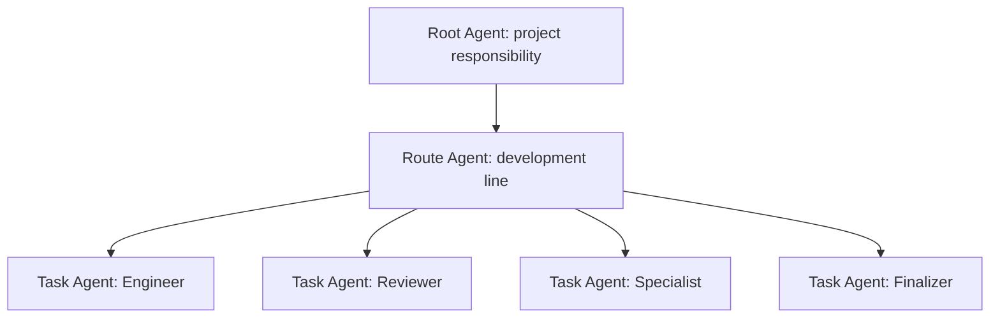

# Agent organization and responsibility

Status: proposed organization vocabulary over existing ACS entities. Root Agent
and Route Agent retain their established meanings. **Task Agent** is the
proposed collective term for an external Agent carrying explicit task
responsibility. This candidate makes its definition and binding rules
reviewable; it introduces descriptive metadata alongside the existing model.

## Two independent dimensions

| Dimension | Meaning | Typical values |
| --- | --- | --- |
| Organization level | Extent of responsibility | Root: project; Route: development line; Task: explicit tasks |
| Responsibility role | Work performed within that extent | Engineer, Reviewer, Specialist, Finalizer; project/Route coordination |
| Profile | Tool-discovery view | root_manager, route_manager, engineer, reviewer, operator |
| Authorization | Actual admitted operations and conditions | Subject, Grant ancestry, Scope, Policy, budget, expected revision and live checks |



This diagram shows a typical external organization. Project-wide tasks may be
coordinated by Root directly. Agent organization can change with the work; its
positions are responsibility descriptions. A Root or Route Agent can also have
an authorized functional responsibility. Organization level does not imply a
particular Profile or grant its permissions.

## Entities and bindings

| Concept | ACS relationship |
| --- | --- |
| External Agent / authenticated principal | Owns reasoning and command decisions; identity is verified at transport/enrollment boundaries |
| Root Agent | External Agent working in explicit Project/Management Root context with the relevant management binding |
| Route Agent | External Agent carrying development-line responsibility in admitted Route context |
| Task Agent (proposed) | External Agent carrying explicit work, analysis, review or finalization responsibility through existing bindings |
| Role | Describes a duty; the same organization level may carry different duties |
| AgentSlot | Durable addressable responsibility in one Scope, used by ownership, Inbox and delivery |
| Scope | Authorization and collaboration-state boundary; a Task label creates no new Scope |
| WorkItem | Versioned unit of intent, assignment, evidence, Review and acceptance; it can involve several role participants and Attempts |
| Session | Replaceable Harness reasoning/execution context with independently observed bindings |
| Attempt / Endpoint | Concrete execution and replaceable capacity with current identity and fencing checks |

Task Agent is neither a WorkItem ID nor a new persistent domain identity.
A Slot can serve multiple WorkItems over time; a WorkItem can involve an
implementer, independent reviewer, specialist and finalizer. Session replacement
preserves the durable work and Inbox rather than replacing their identities.
Cross-Scope participation requires explicit bindings and authorization.

## Configuration and observable facts

`configure_team.members` retains `role` as its compatibility primary label.
Optional `organization_level` (`root`, `route`, `task`) independently declares
responsibility extent. Optional `responsibilities` declares one or more duties
and includes the primary duty. Legacy `root` and `route` primary labels map to
`project_coordination` and `route_coordination`. Each current member binding has
one selected Profile and its explicit Grant. Declarations cannot add permissions
or widen a Scope. Existing team uniqueness, ownership and membership replacement
rules still apply; arbitrary concurrent multi-Slot bindings are not introduced
by this terminology change.

For example, an existing authorized member can declare:

```json
{
  "role": "engineer",
  "organization_level": "route",
  "responsibilities": ["engineer", "specialist"]
}
```

These are the descriptive fields of the existing Member record. Principal,
Slot, Profile, Grant, permissions, expiry, budget and Harness requirements remain
part of the complete closed record. An Agent can combine authorized duties or
change duties through an authorized team revision. Discovery and invocation
still use its Profile and live permissions.

`list_collaborators` presents the primary role, separate organization projection,
responsibilities, Scope, declared Grant permissions and observed binding state.
Role filters match either the primary role or a declared duty. Assignment, Review and Session queries link to existing authorized `list_work`,
`list_reviews` and `list_harnesses` readbacks. Assignment and Review participation
are distinct relations. `match_observations` selects the reviewer's records from
the authorized returned page; it is not an extra tool argument. Query follow-ups
retain actual required arguments, and the caller uses its available Profile and
permissions to perform them.
A declared permission is not a guarantee that an operation's Policy, budget,
Source, candidate or execution preconditions are satisfied.

`load_project` returns the same vocabulary plus `actor_binding`: authenticated
principal, current Slot and Scope, Profile, role projection and Grant summary.
It retains the distinction between requested context view and organization
position. Legacy organization projections are marked as such; unknown bindings
remain unclassified. A projected Task label reports proposed terminology status.
No local or web session name supplies authority or establishes live capacity.

## Combination, independence and acceptance

Engineer implements and produces candidate evidence. Specialist supplies scoped
analysis or expertise. Reviewer evaluates an explicitly selected candidate and
baseline. Finalizer submits an authorized acceptance decision with exact
Source, Evidence, Review and effect/readback prerequisites.

Role combinations are candidate-specific. The same authenticated implementation
or evidence-producing principal cannot become that candidate's independent
Reviewer by changing a label, Slot, Profile or Session. Existing Domain guards
also exclude the initiating/assigned identities where required. A reviewer may
carry other duties for a different eligible candidate when its Grant and
Profile admit those operations. `request_review` recognizes an explicit
reviewer responsibility and then applies the same live Grant, assignment,
producer independence and baseline checks.

Finalizer is a responsibility, not a dedicated Profile value or an automatic
acceptance capability. `accept_work` requires its actual tool/Domain permissions
(including `acceptance.finalize` at the protected transition), exact expected
revision and candidate/source/evidence bindings, current independent Review,
applicable Policy, and required effect/readback facts. `acceptance_ready` and
`accepted` are distinct states. Named product/Gate owner decisions remain
separate requirements when applicable. Runtime never converts a role label,
completed Attempt or self-report into acceptance.

## Decision boundary and compatibility

External Agents choose goals, task decomposition, delegation, role selection,
review strategy and next actions. ACS records their authorized declarations and
bindings, verifies access and candidate constraints, maintains continuity, and
executes deterministic commands.

Organization metadata is stored in the existing versioned Team definition and
projected into context/tools. Existing SQL identities, principal lineage, signed
facts, Role/Profile values and historical records remain intact. The changed
MCP catalog is a guided-upgrade boundary. The proposal's terminology status
must accompany product/UI descriptions until it is formally adopted.
